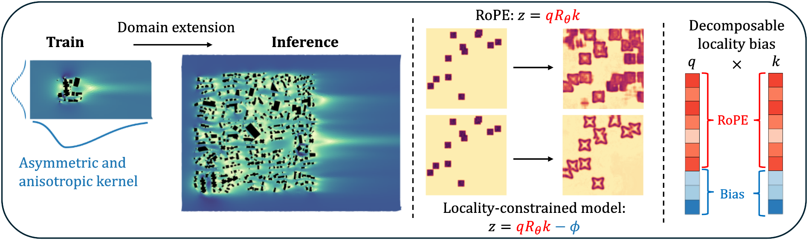

# Zero-shot generalization of transformer neural operators to larger domains




## Requirements

Installation is managed by [uv](https://docs.astral.sh/uv/getting-started/installation/).
Create a fresh environement and install dependencies:

```
uv venv && source .venv/bin/activate
uv sync
```

Finally add the source directory to PYTHONPATH:

```
export PYTHONPATH="/path/to/domain-extension/experiments:$PYTHONPATH"
```

## Datasets

Datasets of the Gray-Scott and Shallow Water cases can be generated using notebooks in `data_generation`.

The Random Buildings Dataset can be downloaded at https://zenodo.org/records/19249906.

Place each dataset in a `data` subdirectory of this project, or alternatively modify the configuration of the experiments to match your own data location.

## Training and evaluation

All experiments presented in the paper are setup in this repo and can be launched with the following commands. `EXPE` refers to either rope, laspe or laape, depending on which experiment you want to run

### Academic cases

Go to experiments/academic_cases.

For SWE, run:


```
uv run noether-train --hp configs/swe1D_train.yaml +experiment=EXPE +seed=1 +run_id=swe1D_EXPE

uv run noether-eval --hp configs/swe1D_evaluation.yaml +run_id=swe1D_EXPE +experiment=EXPE
```

And for GrayScott:


```
uv run noether-train --hp configs/GrayScott_train.yaml +experiment=EXPE +seed=1 +run_id=GrayScott_EXPE

uv run noether-eval --hp configs/GrayScott_evaluation.yaml +run_id=GrayScott_EXPE +experiment=EXPE
```

### AB-SWIFT

Go to experiments/abswift and run:

```
uv run noether-train --hp configs/abswift_train.yaml +experiment=EXPE +run_id=abswift_EXPE

uv run noether-eval --hp configs/evaluation.yaml +experiment=EXPE +run_id=abswift_EXPE
```

Additionally, the notebook lets you visualise an inference using RoPE and LAAPE embeddings.


# Citation

If you find this repo useful, please cite our paper.

```
@Article{deVilleroche2026,
      title={Zero-shot generalization of transformer neural operators larger domains}, 
      author={Armand de Villeroché and Sibo Cheng and Vincent Le Guen and Marc Bocquet and Rem-Sophia Mouradi and Patrick Armand and Alban Farchi and Patrick Massin},
      year={2026},
      eprint={2606.14597},
      archivePrefix={arXiv},
      url={https://arxiv.org/abs/2606.14597}, 
}
```